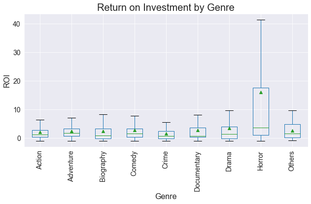
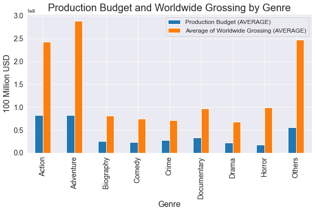
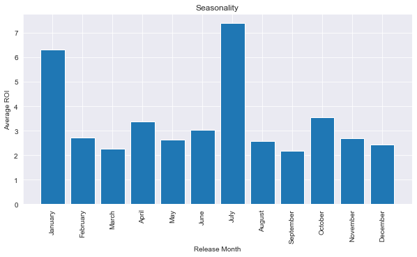
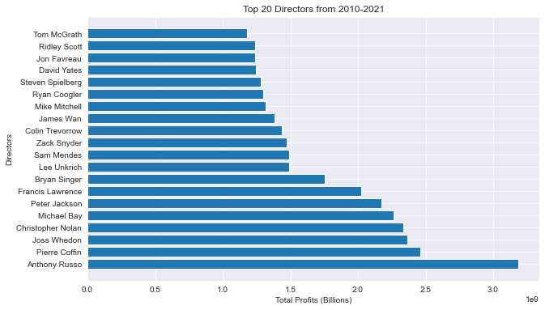

# Recommendations for Microsofts's New Original Studio 
## - Analysis of the most profitable movies

**Authors**: Colin Pelzer, Daniel Burdeno, Emiko Naomasa, Piotr Czolpik

## Overview

In this project, we analyzed box office films released in the past ten years, 2010-2019, and found a pattern in high profit movies. 
Our findings were transformed to actionable recommendations for the Microsoft Studio team to support the launch of a new original movie studio. 
Our analysis revealed which  movie genres provide a higher return, how the season affects tickets sales, 
and which directors have had the most overall success in the market. 


## Business Problem

Microsoft has expressed its interest in entering the film production industry and have decided to create a new movie studio to produce original movies. 
To support the head of Microsoft studio’s decisions on what types of films to create, 
we explored what types of films at the box office can produce a high rate of return and translate into actionable intel. 
In this analysis, we especially focused on the following business questions relating to genres, directors, and the seasonality of the movie industry.

1.	Which genre of movies will promise a high rate of return on investment?   
2.	Are there any seasonal changes in box tickets sales? If so, which months of the year are the best times to release movies? 
3.	Among active movie directors, who will be the best option to produce a movie with high global grossing? 

## Data

To answer our business questions, we used film data from the box office between 2010 and 2019 from [IMDb.com](https://www.imdb.com/) and [The Numbers.com](https://www.the-numbers.com/). 
Detailed information on films, including directors’ names, genres, and release dates, are collected from IMDb.com; 
data on gross revenue and production budgets are from The-Numbers.com. 
After cleaning, our master dataset included 1609 films around the world.  


## Methods

We condacted descriptive data analysis using a rate of return on investment (ROI) as the primary profitability measures in this analysis. 
ROI simply reflects how much return was made per dollar of investment.  

**Return on Investment = (Worldwide Gross – Production Budgets) / Production Budgets** 

Additionally, to assess directors who make the most profitable movies, we used the sum of the net profit of movies according to director. 

## Recommendation 1: Horror movies are good place to invest for a higher ROI. 

**Horror movies outperform other genres in terms of ROI.** 
Figure 1A displays the ROI by genre. 
The median ROI for horror movies is significantly higher than that for other genres, meaning most horror movies have higher ROIs. 
To see why the rate of return for horror movies’ is so high, we also looked at production budget by genre (Figure 1B). 
The average budget on a horror film is considerably lower than other major genres. 
And compared to other genres with similar budget ranges, horror films produce relatively higher global grossing. 
This suggests that horror movies are a good genre for small budgets yielding big returns. 

## Figure 1A


## Figure 1B


## Recommendation 2: Release in July and January 

**The second recommendation is to time the release date for important films.** 
Figure 2 compares the average ROI of movies by release months. 
Movies released in July and January had more than twice the ROI than in other months. 
This corresponds to the summer vacation and winter vacation seasons, when people have more time to go to movie theaters. 
This seasonal trend suggests that production should finish up and be ready to release by one of those months to ensure the highest return on the production budget.

## Figure 2


## Recommendation 3: Opt for famous directors when possible

**For a successful film, offering a famous director will be one of the options.** 
Figure 3 demonstrates the top 20 directors ranked by the total gross each directors' movie made between 2010 and 2019. 
The figure shows some of the most popular names in the industry. 

## Figure 3



## Conclusions

Our analysis on ROI suggests that for a higher return, (1) make a horror film, (2) seek a famous director, (3) and release in July or January. 
We find that horror movies are often made on a low budget, yet the gross is relatively high. 
A list of top 20 directors shows some well-known names, which also guarantee higher profit. 
Finally, release data should be adjusted for people’s vacation seasons. 

One caveat of our ROI analysis is that a high return on investment is not always equal to much cash in hand. 
For the size of the profit, movies with large production budgets often hit the recode high grossing. 
Microsoft is not a small corporation with limited production budgets, and their interest is more in having a larger net profit. 
Thus, for the next step, we will include the size of net profit as our second indicator. 
Additionally, revenue from streaming original movies in their own contents is important income from making original movies. 
So, for the future analysis, we will expand our analysis in that direction. 


## For More Information

Please review our full analysis in [our Jupyter Notebook](./Movie-Studio-Project.ipynb) or our [presentation](./Film-Industry-EDA-PresentationF.pdf).

For any additional questions, please contact **Colin Pelzer - pelzercolin@gmail.com, Daniel Burdeno -email, Emiko Naomasa -email, Piotr Czolpik -email**

## Repository Structure

Describe the structure of your repository and its contents, for example:

```
├── README.md                           <- The top-level README for reviewers of this project
├── Movie-Studio-Project.ipynb          <- Narrative documentation of analysis in Jupyter notebook
├── Film_Industry_EDA_Presentation.pdf  <- PDF version of project presentation
├── data                                <- Both sourced externally and generated from code
└── images                              <- Both sourced externally and generated from code
```
