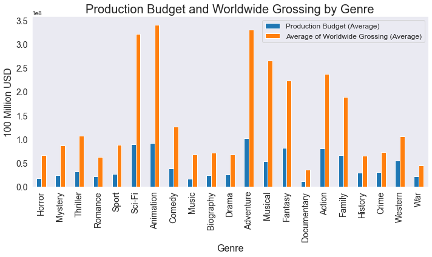
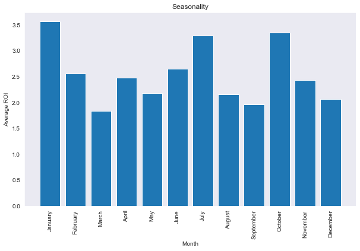
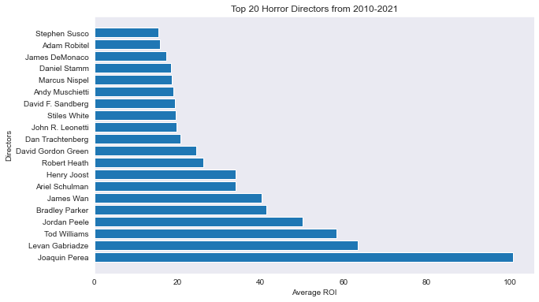

# Recommendations for Microsofts's New Original Studio 
## - Analysis of the most profitable movies

**Authors**: Colin Pelzer, Daniel Burdeno, Emiko Naomasa, Piotr Czolpik

## Overview

In this project, we analyzed box office films released in the past ten years, 2010-2021. 
Our findings were transformed to actionable recommendations for the Microsoft Studio team to support the launch of a new original movie studio. 
Our analysis revealed which movie genres provide a higher return, how the season affects tickets sales, 
and which directors have had the most overall success in the market within the high return genre. 


## Business Problem

Microsoft has expressed its interest in entering the film production industry and have decided to create a new movie studio to produce original movies. 
To support the head of Microsoft studio’s decisions on what types of films to create, 
we explored what types of films at the box office can produce a high rate of return and translate into actionable intel. 
In this analysis, we especially focused on the following business questions relating to genres, directors, and the seasonality of the movie industry.

1.	Which genre of movies will promise a high rate of return on investment?   
2.	Are there any seasonal changes in box tickets sales? If so, which months of the year are the best times to release movies? 
3.	Among active movie directors, who will be the best option to produce a movie with a high potential return on investment? 


## Data

To answer our business questions, we used film data from the box office between 2010 and 2021 from [IMDb.com](https://www.imdb.com/) and [The Numbers.com](https://www.the-numbers.com/). 
Detailed information on films, including directors’ names, genres, and release dates, are collected from IMDb.com; 
data on gross revenue and production budgets are from The-Numbers.com. 
After cleaning and merging, our master dataset included over 1600 films around the world.  


## Methods

We conducted descriptive data analysis using a rate of return on investment (ROI) as the primary profitability measures in this analysis. 
We calculated ROI based off the worldwide gross. Using Python libraries such as, Pandas, Matplotlib, NumPy, and Seaborn, we conducted exploratory
data analysis, and produced three recommendations off of our findings.


## Recommendation 1: Horror and mystery movies are a good place to invest for a higher ROI. 

**Horror and mystery movies outperform other genres in terms of ROI.** 
Figure 1A displays the ROI by genre. 
The mean ROI for horror/mystery movies is relatively higher than that for other genres. 
To see why the rate of return for horror movies’ is so high, we also looked at production budget by genre (Figure 1B). 
The average budget on a horror/mystery film is lower than other major genres. 
And compared to other genres with similar budget ranges, horror/mystery films produce relatively higher global grossing. 
This suggests that horror/mystery movies are a good genre for small budgets yielding big returns. 

## Figure 1A


## Figure 1B



## Recommendation 2: Release in January, July, or October 

**The second recommendation is to time the release date for important films.** 
Figure 2 compares the average ROI of movies by release months. 
Movies released in January, July and October had a considerably higher ROI than in other months. 
This corresponds to the summer vacation and fall/winter vacation seasons, when people have more time to go to movie theaters. 
This seasonal trend suggests that production should finish up and be ready to release by one of those months to ensure the highest return on the production budget.

## Figure 2



## Recommendation 3: Opt for top 20 directors when possible

**For a successful film, offering the top 20 directors will be one of the options.** 
Figure 3 demonstrates the top 20 directors in the horror genre ranked by average ROI for each directors' movie made between 2010 and 2021.
To have the highest potential ROI for your film, we recommend hiring one of these directors.

## Figure 3
 


## Conclusions

**Our analysis on ROI suggests that for a higher return, (1) make a horror/mystery film, (2) release in January, July, or October, and (3) seek the top directors in our list.** 
We find that horror and mystery movies are often made on a low budget, yet the gross is relatively high. 
The release date should be adjusted for three months identified.
Finally, a list of top 20 directors in the horror genre shows the names with the highest return over the last 10 years. 

One caveat of our ROI analysis is that a high return on investment is not always equal to how much cash in hand. 
For the size of the profit, movies with large production budgets often hit the record high grossing. 
Microsoft is not a small corporation with limited production budgets, and their interest might be to have a higher profit. 
Thus, for the next step, we will include the size of net profit as our second indicator. 
Additionally, revenue from streaming original movies on their own platform has greatly expanded in the last several years. 
So, for the future, we will expand our analysis in that direction. 


## For More Information

Please review our full analysis in [our Jupyter Notebook](./Movie-Studio-Project.ipynb) or our [presentation](./Film-Industry-EDA-PresentationF.pdf).

For any additional questions, please contact **Colin Pelzer - pelzercolin@gmail.com, Daniel Burdeno -dan.r.burdeno@gmail.com, Emiko Naomasa -emikonaomasa@gmail.com, Piotr Czolpik -Czolpik1992@yahoo.com**


## Repository Structure

```
├── README.md                           <- The top-level README for reviewers of this project
├── Movie-Studio-Project.ipynb          <- Narrative documentation of analysis in Jupyter notebook
├── Film_Industry_EDA_Presentation.pdf  <- PDF version of project presentation
├── Data                                <- Both sourced externally and generated from code, includes exploratory notebooks
└── Images                              <- Both sourced externally and generated from code
```
