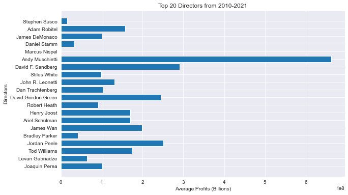

# Recommendations for Microsofts's New Original Studio 
## - Analysis of the most profitable movies

**Authors**: Colin Pelzer, Emiko Naomasa, Daniel Burdeno, Piotr Czolpik

## Overview

  Using Python libraries such as; pandas, matplotlib, NumPy, and seaborn we conducted an EDA on the film industry
over the past ten years. We used our findings to create recommendations for the Microsoft Studio team, 
including the relationship of genre and return on investment (ROI), how the season changing affects consumer habits, 
and which directors have had the most overall success in the market.

In this project, we analyzed box office films released in the past ten years, 2010-2019, and found a pattern in high profit movies. Our findings were transformed to actionable recommendations for the Microsoft Studio team to support the launch of a new original movie studio. Our analysis revealed which  movie genres provide a higher return, how the season affects tickets sales, and which directors have had the most overall success in the market. 


## Business Problem

  Microsoft has expressed interest in going into the original video creation by creating a new movie studio. 
The Microsoft Studio team has tasked us to explore which types of films are dominating the market, 
and translate them into actionable intel that can help the head of Microsofts new studio make
an informed decision on which films they would like to start to produce.

## Data

  The data for this project has been scraped from IMDb.com and The-Numbers.com, both of which contain
raw data that pertains to the film industry as a whole. They include data points such as; worldwide gross,
director name, genres, runtimes, etc. The main variable we want to compare the data points to is
ROI, we want to know how efficient each data point is for a new original content creation studio.

## Methods

  The main library used for cleaning and organizing the data was pandas. We created several data frames
from the datasets provided and did basic cleaning operations. We dropped null values because we deemed that
not only was the data only a fraction, but the rest of the data in the columns were irrelevant. We then made
sure there were no obscene outliers or duplicate data. After we had cleaned and prepared data frames we used
the matplotlib and seaborn libraries to visualize the data. After a few graphs, we prepared three separate
recommendations. We found this approach appropriate since the overall business question was how to carve out
a place in the film market, so finding the types of films, who should be in charge of them, and when to release
the films were all relevant.

## Recommendation 1

  The first recommendation that we made to Microsoft is to pay close attention to the relationship between
genre and ROI. There is a clear correlation between a few genres and a very positive ROI, the biggest surprise
was finding out how profitable horror movies are. The average budget on a horror film is considerably lower than
a CGI-filled action movie like The Avengers. Despite the low budget horror films still succeed in the market over
the past ten years. Even if more movie titles were added and we had more data to parse through, the statement of
"horror films cost less to make, and return a very positive ROI" would still be true, making our data not only relevant
to just our datasets, but the overall market as well.

## Visual 1


## Recommendation 2
  The second recommendation is to time the release date of important films.
We took the release month of movies and compared them to the average ROI of movies released in those months. 
Once the data was separated into months and visualized, when to release became glaringly obvious. Two
months stick out so much they almost look like outliers, July and January account for a large portion of the data.
That being said, production should finish up and be ready to release by one of those months to ensure the highest
return on the production budget.

## Visual 2


## Recommendation 3
Just like the top 1% in net worth, there is a large disproportion in the amount of money the top directors
produce compared to the rest. We visualized the total gross that the directors' movie made, which has pointed
to some of the most popular names in the industry. We recommend that they pick a director who is tried and true
with his production value to ensure the highest chance of having a successful film.

## Visual 3



## Conclusions

Microsoft is not a small company, fortunately for them they have almost limitless resources when it comes
to building a successful film studio. They have the privilege of waiting for the best times to release their new films,
data that proves which genres are most likely to give them a big return on their money, and which director is going
to help their film not only get off the ground, but soar in terms of profitability. The data, as useful as it was, is still limited
when you account for the entirety of the film industry. It's possible that there are slight variations in the data when you account for
the fact that there are hundreds of thousands of more films out there, and those variations could be key indicators of other recommendations; 
however, with the data we were provided however, our analysis helps paint a clearpicture for the studio team, and the best ways 
they can proceed moving foward to give themselves the best statistical chance for success.

## For More Information

Please review our full analysis in [our Jupyter Notebook](./Movie-Studio-Project.ipynb) or our [presentation](./Film-Industry-EDA-PresentationF.pdf).

For any additional questions, please contact **Colin Pelzer - pelzercolin@gmail.com, Daniel Burdeno -email, Emiko Naomasa -email, Piotr Czolpik -email**

## Repository Structure

Describe the structure of your repository and its contents, for example:

```
├── README.md                           <- The top-level README for reviewers of this project
├── Movie-Studio-Project.ipynb          <- Narrative documentation of analysis in Jupyter notebook
├── Film_Industry_EDA_Presentation.pdf  <- PDF version of project presentation
├── data                                <- Both sourced externally and generated from code
└── images                              <- Both sourced externally and generated from code
```
